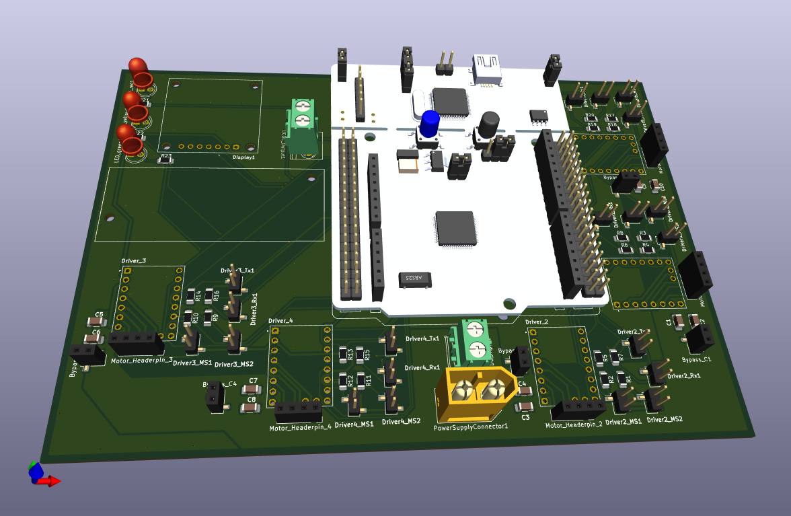

# Elektronik – PCB_Layout (KiCad)

Diese README beschreibt **alles rund um die Leiterplatte**: warum KiCad, was im Ordner `PCB_Layout/` liegt, wie du die Platine **fertigen lässt**, **Bauteile bestellst**, **bestückst** und **in Betrieb nimmst**.

---

## Warum KiCad?

* **Open‑Source & kostenlos**: Reproduzierbar für alle – ideal für ein Open‑Hardware‑Projekt.
* **Versionierbar**: Textbasierte Projektdateien → gut in Git nutzbar.
* **Ökosystem**: iBOM, DRC/ERC‑Checks, Plugin‑Support.

> Getestet mit **KiCad 8.x**. Ältere Versionen funktionieren u. U. nicht.

---

## Ordnerstruktur

```
Elektronik/
└─ PCB_Layout/
   ├─ PCB_Layout.kicad_pro           # Projektdatei (KiCad 8)
   ├─ PCB_Layout.kicad_sch           # Top‑Schaltplan (inkl. Hierarchie)
   ├─ PCB_Layout.kicad_pcb           # Leiterplattenlayout
   ├─ power.kicad_sch                # Sheet: Versorgung/15 V → 5 V 
   ├─ nucleo_F446RE.kicad_sch        # Sheet: NUCLEO‑F446RE 
   ├─ motor_driver.kicad_sch         # Sheet: TMC2209‑Treiber & Motoranschlüsse
   ├─ display_und_LED.kicad_sch      # Sheet: OLED, LEDs
   ├─ AOM12864A0-1.54WW-ANO/         # **Custom Footprint/Symbol** (OLED 1.54")
   ├─ DM-OLED096-636/                # **Custom Footprint/Symbol** (OLED 0.96")
   ├─ NUCLEO-F446RE/                 # **Custom Footprint/Symbol** (Nucleo STM32)
   ├─ TMC2209_SILENTSTEPSTICK/       # **Custom Footprint/Symbol** (Treiber‑Modul)
   ├─ PCB_Layout----
```

**Hinweis zu den Unterordnern:** `AOM12864…`, `DM‑OLED096‑636`, `NUCLEO‑F446RE`, `TMC2209_SILENTSTEPSTICK` enthalten die **projektspezifischen Bibliotheken** (Symbole/Footprints), die **nicht in KiCads Standard‑Libs** vorhanden sind. Damit bleibt das Projekt **voll reproduzierbar**.

---

## Platinenfertigung – Schritt für Schritt

### 1) Gerber/Bohrdaten erzeugen (KiCad)

1. Projekt öffnen → PCB-Editor.
2. **Datei → Plot**

   * Format: **Gerber**
   * Lagen (typisch 2‑lagig): `F.Cu`, `B.Cu`, `F.SilkS`, `B.SilkS`, `F.Mask`, `B.Mask`, `Edge.Cuts` (ggf. `F.Paste/B.Paste` bei Reflow‑SMD)
   * Allgemeine Optionen → Abwählen **Footprintwerte plotten**
   * **Plotten** → anschl. **Bohrdateien generieren**.

3. **ZIP‑Archiv** aus allen Gerber + Drill → `fabrication/<projekt>_gerbers.zip`.


### 2) Hersteller auswählen & bestellen

Wir haben u. a. bei **Multi‑CB** (Multi Circuit Boards) gefertigt: [https://portal.multi-circuit-boards.eu/](https://portal.multi-circuit-boards.eu/)

**Vorgehen (Beispiel Multi‑CB):**

1. Portal öffnen → Online‑Kalkulator → **Optional: CAD-Datei automatisch auslesen** klicken → **Datei anhängen** und dann `fabrication/<projekt>_gerbers.zip` hochladen.
2. Stückzahl auswählen (z. B. 5–10 Stück) & Lieferzeit.
4. Bestellung abschließen.

> Andere Fertiger funktionieren ebenso, solange sie Standard‑Gerber akzeptieren.

---

## Stückliste (BOM) & Bauteilbestellung

### 1) BOM in KiCad erzeugen

* **Schaltplan‑Editor → Werkzeuge → Stückliste (BoM) erstellen** 
* **Exportieren** als CSV → `outputs/bom.csv`.

### 2) Teile kaufen

* Öffne `bom.csv` → bestelle nach **MPN** (Manufacturer Part Number) bei Distributor deiner Wahl (z. B. Conrad, Mouser, etc.).
* Die restlichen Module (z. B. **TMC2209 Treiber**, **NUCLEO‑F446RE**, **OLED 0.96"**) findest du in [dieser Bestellliste](../Bestellliste.xlsx)

> Tipp: SMD Widerstände/Kondensatoren sind i. d. R. 1206 Hand‑Solder‑freundlich.

---

## Bestückung & Montage

### Reihenfolge (empfohlen)

1. **SMD zuerst**, klein → groß (falls SMD vorhanden). Reflow oder Handlötung.
2. **THT** (Stiftleisten, Buchsenleisten, Schraubklemmen).

>Hinweis: Unten auf dem PCB sieht man, dass die Treiber, MCU und OLED Display direkt auf dem PCB gelötet werden können. Allerdings empfehlen wir, die Buchsenleisten an diesen Stellen zu löten und dann Treiber, MCU, Display darauf zu stecken. Damit lassen sich diese Bauteile problemlos ein-/ausstecken, ohne entlöten zu müssen. 

<p align="center">
    
</p>   

3. **Module** stecken:

   * **TMC2209**‑Module in korrekter **Orientierung** (Silkscreen‑Pfeile/Pin‑1). **Falsches Stecken zerstört den Treiber!**
   * **NUCLEO‑F446RE** Board/Socket einsetzen.
   * **OLED/LEDs** nach Polung.

> **Nie** Module stecken/ziehen, solange die Platine unter Spannung steht.

