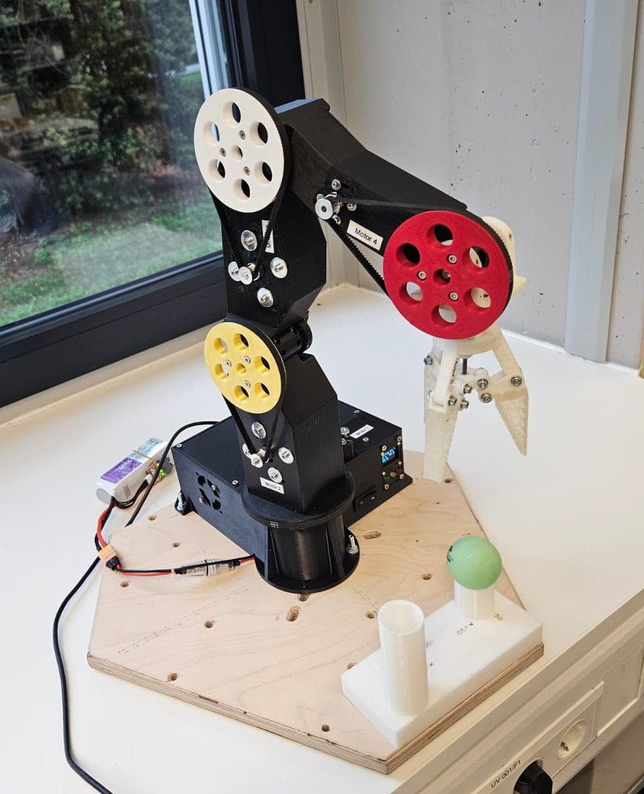

# Roboterarm – Aufbau und Inbetriebnahme

    

    

Dieses Projekt beschreibt den Aufbau und die Inbetriebnahme eines Roboterarms, der mithilfe von 3D-gedruckten Teilen, einer selbstgefertigten Platine und einem STM32F4-Mikrocontroller gesteuert wird.  

---

## 📦 Vorbereitung

1. **3D-Druckteile**  
   - Alle benötigten Teile laut STL-Dateien ausdrucken.  
   - Qualität und Stabilität der Teile prüfen.  

2. **Bestellung von Bauteilen**  
   - Alle mechanischen und elektronischen Komponenten von der Bestellliste besorgen.  

---

## 🔧 Zusammenbau

1. Wenn alle 3D-Druckteile und Bauteile vorhanden sind, den Arm gemäß der **Montageanleitung** zusammenbauen.  
2. Darauf achten, dass alle Schrauben und Lagerungen fest, aber nicht zu stark angezogen sind.  

---

## 🖥️ Platine (PCB)

1. **Fertigung**  
   - Platinendaten herunterladen und bei einem Hersteller fertigen lassen.  

2. **Bestückung**  
   - Bauteile wie Headerpins und Widerstände auf die Platine löten.  
   - Anschließend können Treiber, Nucleoboard und OLED aufgesteckt werden.

3. **Stromversorgung**  
   - Ein zusätzliches Kabel löten, das den Akku mit der Sicherung, dem Schalter und anschließend mit dem DC/DC-Wandler verbindet.  

---

## ⚙️ STM32F4 – Software

1. **Setup**  
   - [STM32CubeIDE](https://www.st.com/en/development-tools/stm32cubeide.html) installieren.  
   - Projektdateien importieren.  

2. **Anpassung**  
   - Bewegungen werden im `main.c` programmiert.  
   - Code per USB auf den Mikrocontroller hochladen.  

3. **Stromversorgung**  
   - Platine mit Akku verbinden.  
   - Schalter umlegen.  

---

## 🔍 Kalibrierung mit StallGuard

Vor der ersten Inbetriebnahme ist eine Kalibrierung der StallGuard-Werte notwendig.  
Empfohlen wird die Nutzung von **STM32CubeMonitor**, um Variablen in Echtzeit auszulesen.  

Wichtige Parameter:  
- `STALL_BUFFER_M_X`  
- `LOW_COUNTER_THRESHOLD_M_X`  
- `STALL_MAX_M_X`  

---

## ▶️ Start

1. Vor dem Start den **schwarzen Reset-Knopf** am Nucleo-Board drücken.  
2. Mit dem **blauen Userbutton** das Programm starten.  

---

## 🎥 Beispielvideo

Einen Eindruck, wie der fertige Roboterarm aussehen kann, gibt es hier:  
[➡️ Video ansehen](https://www.dropbox.com/scl/fi/g09jmz12r2tmc5cvw9wto/Robot4Workshop_v4.mp4?rlkey=lwdefdrdfxj2pr9vu0g0xlj73&st=269ooo00&dl=0)

---

## ✅ Hinweis

- Alle Arbeitsschritte sorgfältig durchführen.  
- Sicherheitsaspekte beim Umgang mit Stromversorgung und Lötarbeiten beachten.  